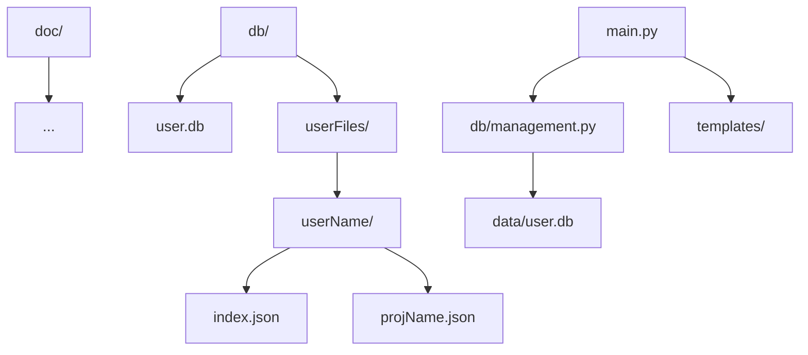
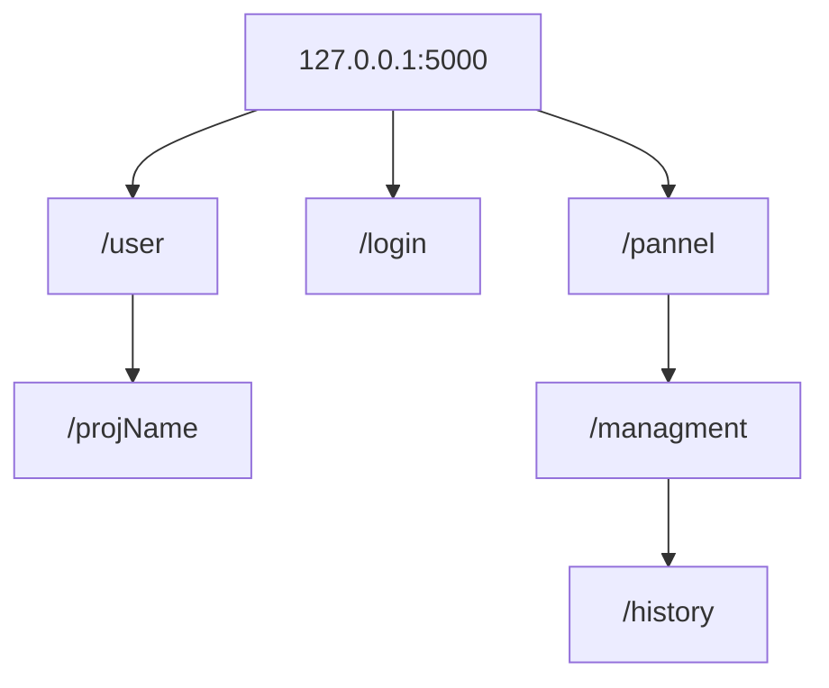

# Plannung

## Libaries

1. Flask
2. Json
3. sqlite3

## Projekt Struktur





## Datei aufbauen


### projName.json

```json
{
	"todo":{
		"statusTypes":[...-userDefined],
		"tasks":[
			{
				"name":"...",
				"task":"...",- Explanition
				"status":int,- one of n statuses of statustypes as index
				"notes":[...],- the user can create notes
				"reports":[...],- everyone can write reports
			},
			...- other tasks	
		]
	}
}
```


### user.db


| id  | username | rights | dateLastAdded | password | session id      |
|-----|----------|--------|---------------|----------|-----------------|
| 1-n | ...      | int    | ...           | hash256  | 32 byte string  |


rights ist nur ein integer wenn man rechte n hat wird in einer liste nachgeschaut was ein user kann mit rechten von level 1 die zahl ist dafür da damit der admin verschiedene stufen definieren kann und rechte nur auf spezielle datein projekte und sub gruppen erstellen kann.


```json
{
	"fileGroups":{
	"nameX":["projX","projY",...]
	
	}

	"rightsDef"[
		[
			["nameX",...,"r"], - Note1
			
		], - Note 2
		
	]


}
```


1. Notes
	1. der erste wert oder eher gesagt alle werte außer der letzte sind die datei gruppen auf die zugegriffen werden darf mit dieser permission der letzte wert beschreibt die rechte dafür 
	2. es kann mehrere verschiedene rechte haben man kann somit sagen ein nutzer kann bei gruppe 1 schreiben und bei gruppe 2 lesen oder so


## Route Planung





## Routs und ihre docs

[user](/doc/user)
[login](/doc/login)


