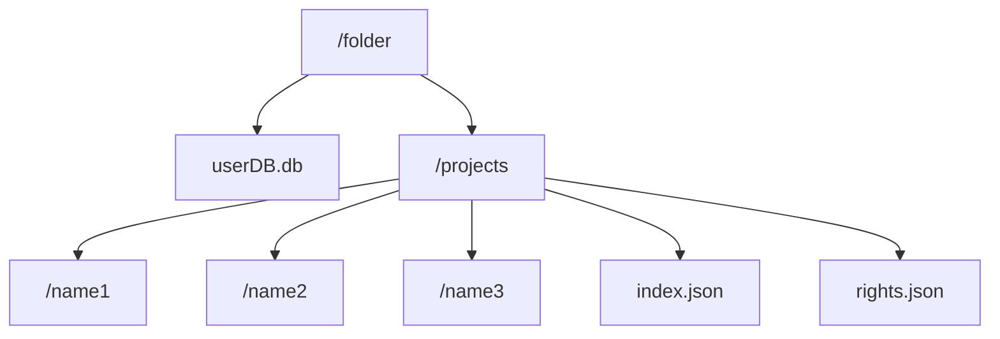
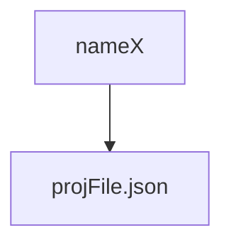

# Datafolder








## projFile.json


```json
{
	"todo":{
		"statusTypes":[...-userDefined],
		"tasks":[
			{
				"name":"...",
				"task":"...",- Explanition
				"status":int,- one of n statuses of statustypes as index
				"notes":[...],- the user can create notes
				"reports":[...],- everyone can write reports
			},
			...- other tasks	
		]
	}
}
```


## rights.json


```json
{
	"fileGroups":{
	"nameX":["projX","projY",...]
	}
	"rightsDef"[
		[
			["nameX",...,"r"], - Note1
		], - Note 2	
	]
}
```


## Aufbau userDB


| id  | username | rights | dateLastAdded | password | session id     | email |
| --- | -------- | ------ | ------------- | -------- | -------------- | ----- |
| 1-n | ...      | int    | ...           | hash256  | 32 byte string | ...   |


