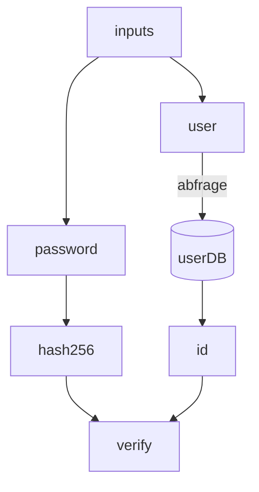
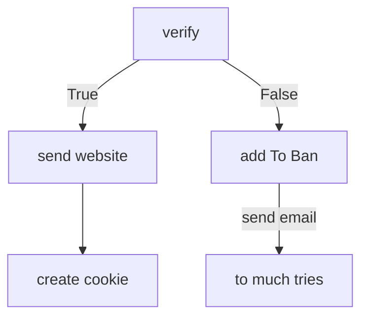

	<input type="text" placeholder="user">
	 
	<input type="password" placeholder="password">
	 
	<button type="sumbit">Senden</button>

## Verify

```mermaid
flowchart TD
inputs[inputs] 
inputs --> user[user]
inputs --> password[password]

password --> hash[hash256]

db[(userDB)]

user --> |abfrage| db

db --> id[id]


hash --> verify

id --> verify


```

```mermaid
flowchart TD

verify[verify]

verify --> |True| send[send website]

send --> create_Cookie[create cookie]

verify --> |False| add[add To Ban]

add --> |send email| to_much[to much tries]

```

